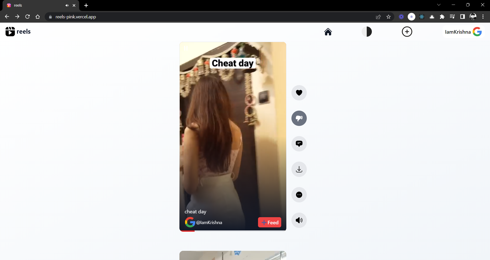
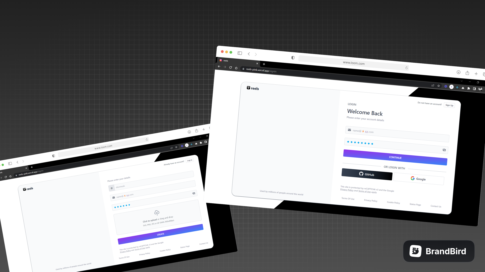
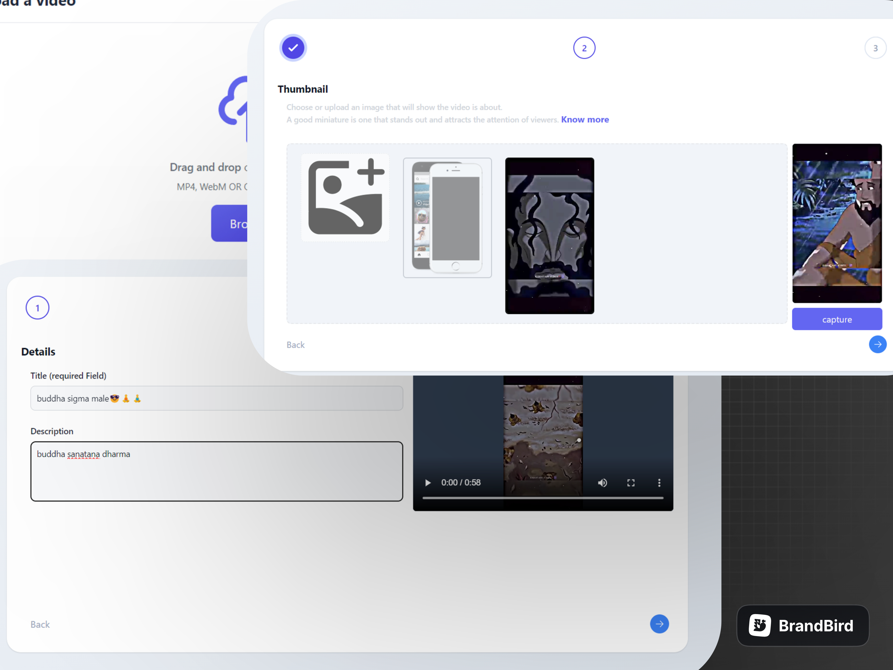
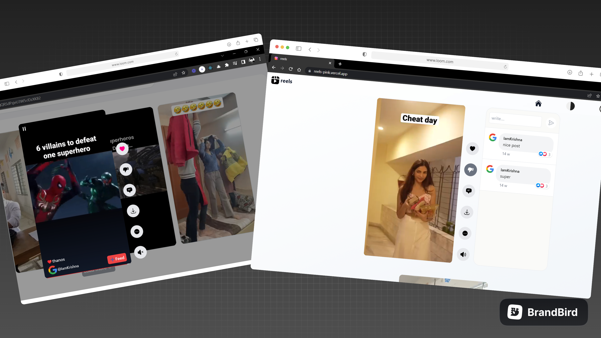
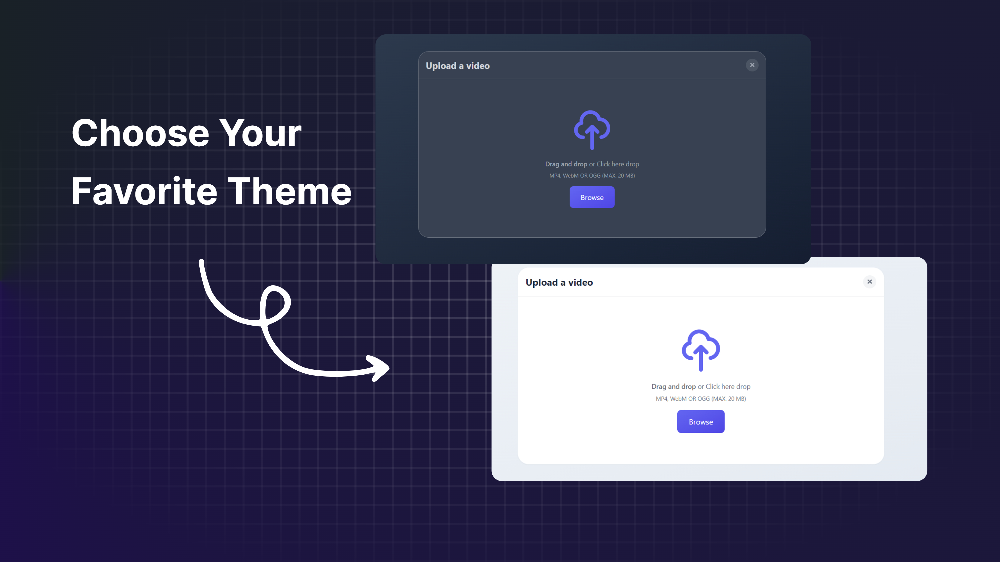

<!-- ABOUT THE PROJECT -->
## About The Project

### Built With

| Client                                                           |                                               Server |
|------------------------------------------------------------------|------------------------------------------------------|
|  [![Next.js shield][nextjs-shield]][nextjs-url]                  | [![Firebase shield][Firebase-shield]][Firebase-url]  |
|  [![Tailwind CSS shield][tailwind-css-shield]][tailwind-css-url] | [![Framer shield][Framer-shield]][Framer-url]        |
|  [![TypeScript shield][typescript-shield]][typescript-url]       |                                                      |

<!-- GETTING STARTED -->
## Getting Started

To run the application on your local machine, follow these steps:

- Open the project folder.
- Install dependencies using npm install.
- make a project on firebase.
- set up environmental variables to Firebase config variables.
- Start the application using npm run dev.
- You will need to have Node.js installed on your local machine to run the application.

<!-- USAGE EXAMPLES -->
## Usage

### 🙋‍♀️ Signin with google  or github or with credentials and upload profile photo and create a username.

### 💬 you can start using the application by uploading a new reel or enjoying the feed.

### like and comment on reels.

### dark theme support

### profile section to track of you uploads

<!-- ROADMAP -->
## Roadmap

- [x] authenticate users
    - [x] signin
        - [x] google
        - [x] credentials
        - [x] github
    - [x] logout
- [ ] post
    - [x] video
    - [x] make thumbnail
    - [x] upload thumbnail
        - [x] like
        - [x] comment
        

